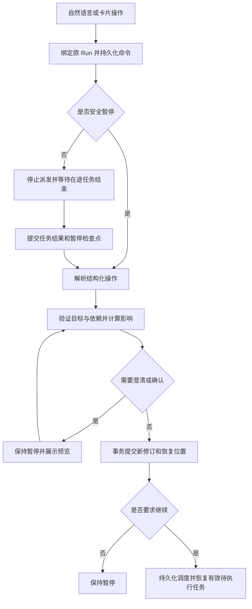

# 局部修改后续跑：实施设计方案

日期：2026-09-06
状态：核心方案已实施，并已通过自动化、浏览器和真实联网链路验收；验收记录见文末。
适用项目：deepresearch_agent_harness

## 1. 目标与交付边界

在现有暂停、恢复机制上增加计划修订能力。用户暂停后，可以通过自然语言或任务卡片修改部分任务，并在原 Run 内继续执行。系统保留有效结果，只执行新增、修改或受修改影响的任务。

第一版必须满足：

- `run_id`、所属会话和历史消息保持连续，修订计划生成新版本。
- 已完成且仍有效的任务不再次调用模型和研究工具。
- 支持修改任务、跳过任务、新增任务、指定任务重跑、修改报告要求。
- 用户说“修改并继续”时应用后恢复；只要求修改时应用后保持暂停。
- 修改涉及依赖、证据、缓存、报告和验收条件时，一致更新其有效性。
- 暂停、修订、恢复期间服务重启后，可根据持久化事实恢复正确状态。
- 页面展示的任务状态与后端实际调度一致，可通过调用记录证明复用与重跑范围。

第一版范围：已有合法计划的 PlanExecute Run，正式应用修改时必须处于 `paused`。`pausing` 期间可接收并保存修改请求，待安全暂停后解析和应用。其他工作流、终态 Run、尚未完成规划的 Run 返回明确提示，不自动创建新研究。改变研究主体、冻结的信息源、工作流或模型配置不属于局部修改，需用户明确选择重新规划或新建 Run。

暂停粒度为任务安全边界。第一版不承诺中断单次 LLM 请求后从已生成 token 或任意工具内部位置继续；进程崩溃时，尚未提交结果的任务可能重试。

## 2. 当前代码基础与必须补齐的缺口

以下依据当前工作区代码核对，路径相对于项目根目录。

| 模块 | 当前基础 | 本方案要求 |
| --- | --- | --- |
| `backend/app/services/chat_service.py` | `is_resume_intent()` 以关键词判断恢复；未命中后进入创建 Run 路径 | 暂停上下文优先路由到 Run 指令服务，复杂指令采用结构化语义解析 |
| `backend/app/services/run_service.py` | 已支持 pause/resume、撤销待生效暂停、恢复调度 | 协调修改请求、运行占用、修订提交和持久化调度 |
| `src/deepresearch_agent/agents/multi_agent/core/plan_spec.py` | 有计划版本、稳定任务 ID、依赖图；任务状态仅 pending/running/completed/failed | 增加任务修订、skipped/blocked、版本化任务定义 |
| `src/deepresearch_agent/agents/multi_agent/core/state.py` | 有 completed_task_ids、检索缓存、中间结果和执行记录 | 构建当前修订的有效结果视图，失效时同步清理派生状态 |
| `src/deepresearch_agent/agents/multi_agent/executor/worker_coordinator.py` | 串行分支接收 stop_predicate；并行分支没有传入该参数 | 两种模式均检查暂停；提交任务结果后再派发后继任务 |
| `src/deepresearch_agent/harness/workflow.py` | 恢复 state、planner_result、report_result；任务进度回调发布事件 | 增加一致的任务提交协议；统一恢复修订后的计划和结果 |
| `src/deepresearch_agent/harness/runtime.py` | 按阶段保存/恢复；`_safe_stage_after(EXECUTING)` 返回 REPORTING | 新快照显式保存恢复位置，不能把任务级执行快照当作执行阶段完成 |
| `src/deepresearch_agent/persistence/repositories/trajectory.py` | `save_plan()` 按 plan_id、task_id 更新原行；多个方法独立开启事务 | 增加不可变历史和共享事务写入，不能只把 version 加一 |
| `frontend/src/pages/ChatPage.tsx` 等 | 已有暂停、恢复和阶段卡片 | 增加修改入口、影响展示、指代上下文和恢复进度 |

现有 `PlanSpec.version` 只是可用基础，不等价于不可变计划历史；现有 task.completed 事件也不能视为已经拥有可恢复的任务检查点。

## 3. 交互及指令路由

### 3.1 页面行为

暂停态保留输入框，任务卡片提供“修改”“跳过”“重新执行”，任务列表提供“添加任务”。报告卡片提供“修改报告要求”。

发送消息时携带 `target_run_id` 和可选 `selected_task_ids`，不要单凭“会话最近的暂停 Run”决定目标。旧客户端没有目标 ID 时，仅在会话内可唯一确定目标的情况下自动绑定，否则澄清。

普通消息路由顺序：

1. 明确点击新研究或明确要求新建：进入现有新建 Run 流程。
2. 有目标暂停/正在暂停的 Run：进入 RunCommandService。
3. 没有暂停目标：保持现有普通研究消息行为。

RunCommandService 解析后区分 `resume`、`modify`、`modify_and_resume`、`cancel`、`inspect`、`new_run`、`clarify`。询问当前进度等 inspect 指令只读回答，不触发执行。

无歧义短指令可走精确规则快速通道。包含修改、跳过、否定、条件或复合语句时必须进入语义解析，不能因出现“继续”就提前命中恢复规则。

### 3.2 执行与确认规则

| 用户输入 | 行为 |
| --- | --- |
| “继续”“接着做” | 恢复当前有效版本 |
| “跳过工业界应用案例调查，其他继续” | 唯一定位目标且依赖处理明确时，应用修订并恢复 |
| “把任务 B 改成调查欺诈检测” | 应用修改并保持暂停，显示“已修改，等待恢复” |
| “保留调查结果，只把报告改成中文并继续” | 更新报告要求，复用研究结果，从 reporting 恢复 |
| “跳过这个”且没有选中卡片、有多个候选 | 保持暂停，展示候选供用户选择 |
| “不要继续，先把任务 B 改掉” | 修改后保持暂停 |
| “换个研究主题”且未明确处理当前 Run | 澄清是新建还是整体重新规划 |
| 模型解析失败/超时 | 请求保留为失败或待澄清状态；不恢复、不新建 Run |

有依赖歧义、无法唯一定位任务或涉及较大范围调整时展示预览并等待确认。清楚表达“修改并继续”的请求，无上述问题时可直接应用，不强制增加一轮确认。

`pausing` 期间修改请求返回已接收状态，并显示“修改将在当前任务结束后生效”。修改请求存在时，单独点击恢复不得绕过它；用户需先应用或撤销待处理修改。取消 Run 会使所有未应用修改请求终止。

## 4. 服务划分与处理链路

新增以下服务；命名为建议，路径可按项目现有组织落地：

| 服务 | 职责 |
| --- | --- |
| `backend/app/services/run_command_service.py` | 请求去重、目标 Run 绑定、LLM 指令解析、澄清和命令编排 |
| `src/deepresearch_agent/harness/plan_revision.py` | 结构化操作验证、版本检查、候选计划构建、修订事务 |
| `src/deepresearch_agent/harness/impact_analysis.py` | 依赖闭包、结果失效、证据使用关系和恢复阶段计算 |
| `src/deepresearch_agent/harness/task_commit.py` | 任务结果、有效状态、checkpoint 和事件的原子提交 |

处理链路：



LLM 输入只包含用户命令、所选卡片、当前计划和状态、必要结果摘要、操作 schema。LLM 输出结构化操作，不能直接写数据库、决定缓存复用或任意降低验收标准。影响分析由确定性代码完成。

## 5. 结构化变更协议

### 5.1 支持的操作

| 操作 | 必填内容 | 约束 |
| --- | --- | --- |
| `update_task` | task_id、changes | changes 仅允许描述、参数、实体、合法任务类型、依赖和优先级等白名单字段 |
| `skip_task` | task_id、reason、dependents_policy | 不删除历史；策略为 block/cascade_skip，默认 block |
| `add_task` | 客户端临时 ID、任务定义 | 服务端分配稳定 ID；依赖临时 ID 在同一批操作中统一解析 |
| `rerun_task` | task_id、reason | 即使任务定义相同，也强制产生新的执行修订并失效下游 |
| `update_report_requirements` | changes | 仅允许语言、格式、篇幅、章节等报告要求，不偷偷修改研究范围 |
| `update_scope` | 排除/保留项、关联任务或验收项 ID | 仅用于用户明确的局部范围调整，不允许改写核心研究主体 |

禁止用户或 LLM 直接赋值 status、completed_task_ids、预算已用量、execution_epoch、结果有效性、冻结来源和模型配置。所有操作先作用于计划副本，整批验证通过才可提交，不能部分成功。

### 5.2 请求示例

```json
{
  "request_id": "edit_01",
  "target_run_id": "run_example",
  "base_revision": 3,
  "base_checkpoint_version": 12,
  "intent": "modify_and_resume",
  "operations": [
    {
      "type": "skip_task",
      "task_id": "task_industry",
      "reason": "用户不再要求工业界应用案例与工具生态调查",
      "dependents_policy": "block"
    }
  ]
}
```

修订预览返回：操作前后差异、保留结果任务、待重跑任务、跳过任务、阻塞任务、失效产物、范围变化、恢复阶段、是否需要确认、预览 hash。预览不修改正在使用的计划。

示例目标任务没有后继依赖时可直接应用；若存在依赖，返回阻塞明细并要求解决，不能将 skipped 偷换成 completed。

## 6. 数据模型与事实来源

### 6.1 版本语义

- `run_id`：研究运行身份，不因局部修改变化。
- `revision`：Run 内活动修订号，任意已应用变更（含报告要求）递增。作为统一并发版本；对应活动 PlanSpec.version。
- `task_id`：任务稳定身份。修改保持 ID，新增才分配 ID。
- `task_revision`：任务语义、依赖输入或强制重跑变化时递增；仅展示优先级等调度变化不使有效输出失效。
- `attempt_id`：一次实际任务执行尝试，任务重试生成新值。
- `execution_epoch`：运行写入代次，在调度获得执行权或控制权失效时递增，用于隔离旧 Worker。
- `checkpoint_version`：持久化快照序号，与计划修订号分别维护。

### 6.2 新增表和字段

采用增加历史表、保留现有投影表的迁移方式，避免直接重建现有 tasks 主键和外键。

| 表/字段 | 设计 |
| --- | --- |
| `runs.active_revision` | 当前修订号，默认迁移为已知活动版本 |
| `runs.execution_epoch` | 整数代次，默认 0；写入使用条件更新 |
| `runs.active_checkpoint_version` | 活动快照指针，与修订在同一事务更新 |
| `run_revisions`（新增） | 主键 `(run_id, revision)`；parent_revision、plan_json、report_requirements_json、scope_json、impact_json、request_id、created_at |
| `run_edit_requests`（新增） | request_id、run_id、payload_hash、base_revision、base_checkpoint_version、intent、operations_json、preview_hash、status、result_revision、错误/澄清信息；唯一 `(run_id, request_id)` |
| `task_revisions`（新增） | 主键 `(run_id, task_id, task_revision)`；definition_json、definition_hash、created_revision；定义不可变 |
| `task_attempts`（新增） | attempt_id、run_id、task_id、task_revision、execution_epoch、input_fingerprint、status、record_json、output_hash、usage_json |
| `revision_task_results`（新增） | 主键 `(run_id, revision, task_id)`；task_revision、status、有效 attempt_id、失效/跳过/阻塞原因 |
| `revision_evidence_links`（新增） | run_id、revision、task_id、attempt_id、evidence_id、用途与有效性；支持同一证据被多个有效任务引用 |
| `revision_artifacts`（新增） | run_id、revision、artifact_id、kind、input_hash；报告和验证结果只绑定其适用修订 |
| `run_outbox`（新增） | outbox_id、run_id、kind、payload_json、dedupe_key、投递状态与重试字段；支持 SSE 通知和恢复调度 |

现有 `plans`、`tasks` 作为活动计划/任务的兼容投影，历史由新表提供。不能把现有 save_plan() 的覆盖更新当作历史存储。所有 API 读取明确区分“当前版本”和“历史版本”。

RunRevision 加当前版本结果映射是有效性的事实来源；checkpoint 是对应版本的可恢复执行快照；旧表是兼容投影。它们必须在同一事务提交。启动时若版本/指针不一致，应报告恢复错误并停止调度，不能混用新旧状态。

### 6.3 状态分离

任务调度状态增加 `skipped`、`blocked`。`stale` 不作为混杂的任务运行状态：旧 attempt 的结果是否有效由版本结果映射表达，当前需重跑任务置为 pending。

命令状态独立为 `received → waiting_for_pause / interpreting → needs_clarification / ready → applied`，另有 failed、superseded、cancelled。Run 无需增加 editing 状态；解析和编辑时保持 paused。

## 7. 影响分析及结果复用

### 7.1 确定性算法

1. 复制基础修订，应用全部操作并校验任务 ID、类型、来源、依赖存在性和 DAG 无环。
2. 区分展示/调度变化与执行语义变化。纯优先级调整保留已有输出；研究描述、参数、依赖改变或 rerun_task 形成失效根。
3. 在旧图和新图的依赖边并集上计算失效根的传递下游，避免删除旧依赖边时遗漏曾经消费过旧结果的任务。
4. 合并真实结果消费关系。若 Worker 使用未声明的共享上下文或全局证据，必须将消费者纳入影响范围；关系不完整时保守扩大重跑范围，不宣称无依据的复用。
5. 跳过任务处理其后继：block 保留阻塞，cascade_skip 显式跳过全部后继；改写依赖需由 update_task 明确表达并重新验证。
6. 对可复用结果校验输入指纹、依赖输出、来源和有效性；受影响任务生成新 task_revision，其当前结果映射置 pending 或 blocked。
7. 更新当前版本证据关联，研究有效集合变化时使旧报告和验证结果不再适用于新版本。
8. 计算新的恢复阶段并生成可解释影响清单。

### 7.2 输入指纹与复用规则

```text
input_fingerprint = SHA256(canonical_json({
  execution_task_definition,
  consumed_dependency_output_hashes,
  consumed_shared_context_hash,
  frozen_source_and_model_config,
  relevant_prompt_and_skill_versions
}))
```

不要直接把全局 revision 或整个计划 hash 放进指纹，否则任意局部修改都会让全部任务失效。依赖顺序、字典顺序和默认值必须规范化；参数数组中有业务意义的顺序保持不变。

复用条件：有效 completed attempt、匹配当前 task_revision 和实际输入、依赖结果仍有效。强制重跑由新 task_revision 阻止命中原结果。报告语言变化不改变研究任务输入。

### 7.3 必须同步处理的状态

应用修订时重建活动 PlanExecuteState：

- `state.plan` 和 `planner_result.plan_spec` 指向同一新计划；重新生成执行 signal。
- completed_task_ids 仅包含当前版本有效完成任务，不包括 skipped。
- retrieval_cache、intermediate_results 删除受影响任务项，保留可验证有效项。
- execution_records 对执行器和报告器仅暴露有效记录；全部历史存储仍保留。
- 受影响任务的 reflection_retry_counts 按新修订开始；总 Run 预算和整体次数限制保持累计。
- 相关 report_result、response、verification_failures、repair_pending 和历史验收结论不得继续作为当前结果。
- 所有证据 API、报告器、验证器使用当前修订的证据视图，不能只修改前端过滤。

不要全局作废一个共享 evidence_id：它可能仍被其他有效任务引用。撤销的是具体修订/任务的使用关系。旧报告保留为历史产物，页面明确标注其版本。

### 7.4 验收条件随范围变化

用户主动跳过的内容记录为 `scope_exclusions`，带原消息与修订来源。旧的自由文本验收条件需增加稳定 ID 或映射，才能显式撤销对应范围要求。

可以撤销“必须覆盖已排除任务”的条件；不能自动降低真实性、引用有效性等全局质量要求。若无法判断某项验收要求与跳过任务的关系，保持暂停并澄清。报告应说明主动排除范围，验证器不得因该范围缺失重新安排调查。

## 8. 任务级暂停与恢复协议

### 8.1 显式恢复游标

增加 checkpoint schema 版本及以下字段：

```json
{
  "schema_version": 2,
  "run_id": "run_example",
  "active_revision": 4,
  "execution_epoch": 8,
  "checkpoint_kind": "task_boundary",
  "resume_cursor": {
    "stage": "executing",
    "stage_complete": false
  },
  "workflow_state": {}
}
```

示例中的 schema_version 为协议示意；实施时在实际 CHECKPOINT_SCHEMA_VERSION 基础上递增。`checkpoint_kind` 至少区分 stage_end、task_boundary、paused、revision_applied。

新快照一律读取显式 resume_cursor；不得对 task_boundary 快照调用 `_safe_stage_after(EXECUTING)`。阶段完成时游标指向下一阶段；任务完成但阶段未完成时仍指向 executing。

### 8.2 任务提交与暂停

1. 每次派发前检查持久化暂停/取消请求和执行 epoch。
2. Worker 接收带 revision、task_revision、epoch 的输入副本，返回结果及状态增量。尤其并行模式下，Worker 不直接修改共享活动状态。
3. 协调器串行合并结果，在事务中验证执行权，保存 attempt、证据关联、任务状态、使用量、checkpoint 及 outbox 事件。
4. 事务成功后才发布 task.completed 和派发依赖它的任务。不能在记录尚未合并时从进度回调中直接 snapshot。
5. 有暂停请求时停止新派发；并行在途任务结束并提交后，原子写入 paused 和暂停快照。
6. 超时调用按现有/明确新增的超时策略结束。线程未结束时不得声称已安全暂停；隔离旧结果也不能保证远端请求立即停止计费。

执行函数返回结构化结果 `completed / paused / budget_exhausted / failed`，替代仅返回 records 的隐式约定。Runtime 收到 paused 不进入 reporting，不触发因研究未完成而重新规划的质量分支。

### 8.3 恢复阶段选择

按以下优先顺序计算：

| 条件 | 处理 |
| --- | --- |
| 尚有未解决的依赖/指代问题 | 保持 paused，命令需要澄清 |
| 存在 pending 任务 | executing；按有效依赖调度 |
| 研究已满足修订范围，但报告缺失或失效 | reporting |
| 报告有效但当前版本验证缺失/失效 | verifying |
| 没有语义变更 | 不增加空修订，继续原显式游标 |
| 所有研究任务被跳过且无可用证据 | 保持 paused，解释无法按研究完成标准交付；不自动生成无依据报告 |

报告完成不直接设置 completed，仍需通过当前修订的 Completion Contract。

## 9. 修订原子提交与并发控制

解析 LLM、影响计算和预览均在数据库事务外执行，不能长时间持有 SQLite 写锁。提交过程使用短事务和条件更新：

```text
apply(request, preview):
  begin transaction
  return persisted result if identical request already applied
  reject if request_id reused with different payload_hash
  require run.status == paused and no active execution owner
  compare active_revision, checkpoint_version and preview_hash
  reserve new revision and increment execution_epoch with conditional UPDATE
  write immutable revision/task definitions and effective result links
  update active compatibility projections and derived workflow state
  write checkpoint and update runs.active_checkpoint_version
  mark request applied; append durable revision event
  if intent == modify_and_resume:
      write deduplicated resume dispatch item
  commit
```

实现时为相关 Repository 增加接受共享 AsyncSession 的事务内方法。不能依次调用现有各自开启事务的方法并认为它们整体原子。

LLM 解析期间其他请求可能先提交，因此 apply 必须再次验证基础版本。版本过期返回 409，展示最新差异；不得将旧预览自动套用到新计划。每个 Run 最多一个未解决的编辑命令，第二条返回当前待处理请求；用户可显式撤销后重新提交，避免未知排序。

恢复消费者必须在数据库中竞争执行 lease 和 epoch，进程内 `_tasks` 去重只是补充。消费 outbox 前先看当前 Run 是否仍允许恢复；取消或新修订使旧调度项失效。消费者崩溃后重复投递安全，启动扫描也应发现已提交但尚未开始的恢复意图。

Worker 写结果必须同时匹配 epoch、任务修订和 attempt 状态，迟到结果只记录为被隔离的历史尝试，不修改当前证据/结果视图。已实际发生的调用成本仍计入用量。

## 10. HTTP API 与事件

以下为新增协议，保留现有 pause/resume API。路径省略统一 `/api/v1` 前缀。

| 接口 | 用途 |
| --- | --- |
| `POST /runs/{run_id}/commands` | 自然语言或结构化操作；持久化接收后返回命令 ID，后台解析；明确授权的修改并继续可自动应用 |
| `GET /runs/{run_id}/commands/{request_id}` | 查询 waiting_for_pause、needs_clarification、preview、applied 和错误 |
| `POST /runs/{run_id}/commands/{request_id}/clarifications` | 补充目标/依赖处理，生成更新预览；不走新建研究接口 |
| `POST /runs/{run_id}/commands/{request_id}/apply` | 用户确认的 ready 预览提交；携带基础版本、preview_hash 和 resume 标志 |
| `POST /runs/{run_id}/commands/{request_id}/cancel` | 撤销尚未应用的编辑命令，Run 保持原状态 |
| `GET /runs/{run_id}/revisions` | 修订历史及当前活动版本 |
| `GET /runs/{run_id}/revisions/{revision}` | 查看特定版本计划、影响及有效产物 |

聊天消息仍持久化到原 Run，metadata 记录 command_id。扩展消息响应为兼容的可辨识联合类型或新增可选 command 字段，不能把待澄清响应伪装为新 RunAccepted。

状态码：202 表示命令已接收或等待暂停；200 表示已完成/幂等重放；404 为目标不存在；409 为版本/状态/幂等键冲突；422 为非法操作、循环依赖或不支持的范围。异步模型失败通过命令状态和事件暴露。

新增事件建议：command.received、command.needs_clarification、command.failed、plan.revision_previewed、plan.revision_applied、task.result_reused、task.invalidated、task.skipped、run.recovery_progress。

事件包含 run_id、revision、request_id、checkpoint_version，任务事件补充 task_id/task_revision。沿用持久化事件序号和重放能力；前端按 event_id 去重，旧版本任务事件不能覆盖当前卡片状态，但可在历史视图展示。

## 11. 前端显示和恢复耗时

任务卡片显示“已完成（复用）”“待重新执行”“已跳过”“被依赖阻塞”及原因。修订摘要说明哪些结果保留、哪些任务重跑、报告是否重新生成，不把所有卡片统一重置为进行中。

恢复进度建议按实际后端事件显示“正在恢复任务状态”“已复用 3 项结果”“正在执行任务 B”。报告模型调用开始后显示报告正在生成，避免让用户把模型等待误认为恢复初始化。

记录 resume_requested_at、lease_acquired_at、checkpoint_loaded_at、first_task_dispatched_at、first_model_token_at（Provider 支持时），以及 reused_task_count、rerun_task_count、discarded_late_result_count。分别统计恢复调度延迟与模型/工具耗时。

性能目标在测试环境建立基线后设定；不在未测量情况下承诺固定恢复秒数。恢复不能再次调用 Planner，除非用户明确要求整体重新规划或进入已有质量重规划流程。修改解释器的模型调用与研究 Planner 调用分别标识。

## 12. 迁移与兼容策略

1. 新增 Alembic 迁移；项目本地 create_schema 路径也需覆盖必要增量字段，验证旧数据库启动，不只测试空库。
2. 为现有 Run 建立活动修订基线，保留原 plan_id/task_id 和历史数据，不伪造过去不存在的计划版本。
3. 旧阶段级 checkpoint 经适配器生成显式游标：仅对确认是旧 stage_end 的状态使用原 `_safe_stage_after` 规则；paused 优先使用已存 resume_from_status。
4. 对旧结果可验证的部分建立 revision 关联；输入来源不完整的结果标为不可保证复用，并在修改预览说明影响，不能静默宣称精确复用。
5. 缺失或损坏 checkpoint 时维持暂停并报告原因，不能把修改后的恢复降级为 queued 从头执行。
6. 以功能开关启用 PlanExecute 局部修订；开关关闭只禁止新修订，已经产生的新 schema Run 仍需由兼容版本读取。
7. 回退应用版本前确认其能读取新 schema；不直接删除历史表或覆盖用户结果来“回滚”。

## 13. 实施拆分与交付物

| 阶段 | 主要工作 | 完成门槛 |
| --- | --- | --- |
| P1：持久化和恢复协议 | 历史表、版本指针、事务方法、显式游标、旧快照适配 | 旧 Run 可恢复；任务级快照不跳到报告阶段 |
| P2：任务安全暂停 | 串/并行停止派发、Worker 状态增量、任务原子提交、epoch 隔离 | 完成 A 后暂停，恢复不重跑 A；并行在途任务不会污染修订 |
| P3：结构化局部修订 | 操作 schema、影响分析、证据视图、原子 apply、outbox | API 能修改/跳过/新增/重跑任务及修改报告要求 |
| P4：自然语言与页面 | 命令解析、指代澄清、卡片编辑、修订摘要、恢复进度 | “跳过该任务并继续”始终绑定原 Run，复杂语义不会误命中恢复 |
| P5：真实链路验证 | 本地集成、真实 Provider、小预算浏览器验收、故障注入 | 满足第 14 节证据要求，记录仍有的任务内重试限制 |

实现期间保留当前工作区无关改动；本文只定义后续实现，不要求修改现有报告展示工作。旧研究结果不会因数据库迁移被删除。

## 14. 测试与验收

### 14.1 关键测试矩阵

| 场景 | 必须断言 |
| --- | --- |
| A 已完成，暂停后修改独立 B 并恢复 | 同一 run_id；A 模型/工具调用数不增加；B 使用新输入 |
| A → B → C，修改 A | A/B/C 原结果不进入新报告；无关 D 复用 |
| 修改 B 移除旧依赖 | 旧/新图合并分析不漏掉旧结果消费者 |
| 跳过独立任务 | skipped 不执行；报告和验收排除其范围 |
| 跳过被依赖任务 | 默认阻塞并澄清；显式级联跳过才跳过后继 |
| 只修改报告语言并继续 | 不新增研究任务调用；报告和验证重跑 |
| 强制重跑但参数不变 | 新任务修订实际执行；旧缓存不误命中 |
| 新增任务依赖已完成任务 | 复用已完成输入，仅新增任务及受影响消费者执行 |
| “不要继续，先修改”“跳过后继续” | 正确保留否定和复合意图，无新 Run |
| 目标指代不清或两个暂停 Run | 澄清，不能随机绑定或创建研究 |
| 串行/并行 pausing 中提交修改 | 停止新派发；等待安全提交后应用 |
| 新增任务级 checkpoint 后异常重启 | 恢复 executing，不误跳 reporting |
| 修订提交前故障 | 无部分新版本；旧版本仍完整可恢复 |
| 提交后、调度前故障 | 启动重放 outbox，恢复相同修订，无重复执行实例 |
| 重复 request_id / 同键不同内容 | 前者返回原结果，后者冲突 |
| 两个客户端竞争、迟到 Worker | 条件更新只允许一个修订成功；旧 epoch 不能覆盖新结果 |
| 共享证据、多版本报告 | 无关任务仍能使用共享证据；当前报告不能混入失效关联 |
| 取消与修订/恢复并发 | 取消后待处理命令和旧恢复调度不启动新工作 |
| 全部任务跳过、预算耗尽、解析失败 | 有明确状态和原因，不伪造研究完成 |
| 旧数据库及旧 checkpoint | 可迁移读取；缺失信息显式提示，不静默从头研究 |

### 14.2 真实链路验收步骤

使用独立测试 Session 和受控预算，不操作用户已有研究 Run。

1. 通过真实聊天页面启动含 A、B、C 的计划，记录 run_id、revision 和 Planner 调用计数。
2. A 完成后点击暂停，确认后台 paused、A 的结果与 checkpoint 已提交。
3. 发送“跳过 B，其他按原计划继续”，记录命令、修订和影响清单。
4. 确认原 run_id 保留，revision 递增；B 无新增执行调用；A 的调用计数不增加；C 按有效依赖执行。
5. 检查报告和验收输入：没有 B 的失效结果，明确反映调整后的研究范围。
6. 在另一测试 Run 验证修改已完成 A，确认受影响下游重跑，无关任务保留。
7. 验证“仅修改报告为中文”，研究调用次数保持不变。
8. 在隔离测试进程中于修订提交后终止服务并重启，验证恢复的是相同修订和游标。

验收报告保存：前后 Run/修订/任务尝试 ID、事件时间线、模型与工具调用计数差异、checkpoint 游标、最终报告引用和失败场景结果。日志不记录 API 密钥等敏感配置。不能只以卡片颜色或任务状态证明后端复用。

研究模型和解释器调用使用不同角色标签：合理发生的一次指令解析调用不能被误判为重新规划；真正再次调用 Planner 必须能被验收检测到。

## 15. 交付定义

功能完成意味着：用户能在同一 Run 内安全修改局部计划；修改影响可解释；已完成的有效任务经调用记录证明得到复用；失效结果不会进入新报告；暂停和恢复遇到重启、并发、重复提交时仍保持一致。

对外仍应明确：系统提供任务安全边界的续跑，无法保证进程崩溃前尚未提交的单次模型/工具调用绝不重复。进一步的工具内部断点续传、流式生成续写及更精细的依赖消费分析作为后续能力建设。

## 16. 实施与验收记录（2026-09-06）

已交付同一 Run 的暂停后局部修订：自然语言或卡片可修改、跳过、新增、重跑任务及调整报告要求；后端生成新 revision，计算依赖闭包，只清除受影响任务的执行记录、缓存与证据视图。串行和并行调度均从持久化任务边界恢复，任务级 checkpoint 与执行租约用于防止迟到 Worker 覆盖新修订。页面可预览复用、失效、跳过和待执行清单，并支持应用、恢复、补充说明及撤销。

验证结果：

- 后端核心与回归测试 67 项通过，覆盖依赖闭包、级联跳过、报告单独重跑、串/并行续跑、原子修订、幂等和重启读取。
- 前端生产构建通过；真实浏览器确认计划从 revision 1 更新为 revision 2，已完成任务保持复用，修改后的任务内容和影响预览即时可见。
- 真实 `plan_execute_report` + `web` 链路使用 200,000 token 上限完成：Run `run_ac205aa567e24a08a72dd824cc7dc135` 保持不变；`task_001` 复用，`task_003` 跳过且没有启动，恢复后只执行 `task_002`；Planner 重跑次数为 0；共 2 次 Tavily / 2 次工具调用，最终报告仅包含保留范围。
- 真实链路机器可读结果位于 `data/acceptance/partial-resume/55ea2c5f/result.json`，最终报告位于同目录对应 Run 的 `report/final.md`。
